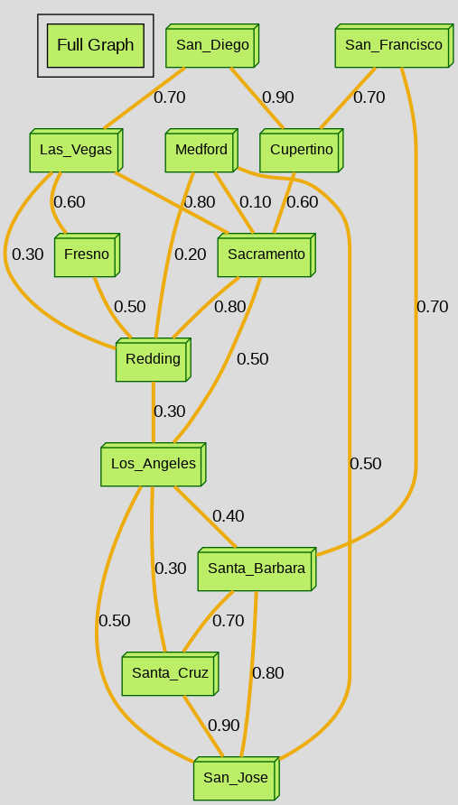
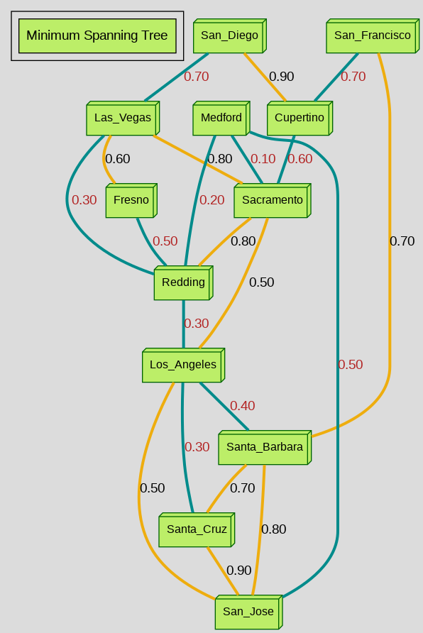
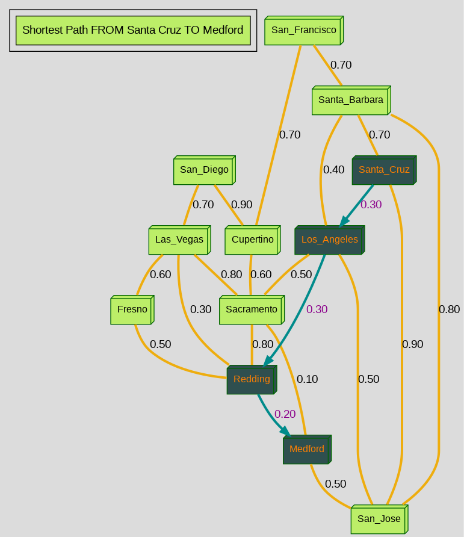

# Project Description

## Overview

This project was built to demonstrate the combined utilization of basic graphical applications and
the well-known Djikstra's algorithm and Prim's algorithm to process and visualize optimal path solutions.

Instead of accepting graphical information in the traditional forms of adjacency matricies or adjacency
lists, this program processes graphical information in a more human-friendly format for ease of access
to individuals who wish to both provide and view graphical data in a more widely understood format.


## Processing of User-Provided Graphical Information

This program processes a text file, where each line contains the information for each unique edge
in the graph to be processed. This line-by-line format is structured in the following way:

```
vertex1_name, vertex2_name, distance_between_vertex1_and_vertex2
```

For referencing purposes, several sample text files (of varying amounts of graphical densities)
that adhere to the proper format for processing are included in the [sample_graphs](./sample_graphs/) directory.

Text files, whose contents match the outlined format and are placed within the `sample_graphs` directory,
will be detected by the program and presented to the user in the terminal for selection upon starting the program.

After recieving the name of the text file to be processed, the program will utilize customized data structures and 
[Graphviz](https://www.graphviz.org/) to generate a graphical representation of the entire graph overlayed with either:

1.  The path with the shortest distance/lowest cost from a selected source vertex to a selected destination vertex
2.  The [Minimum Spanning Tree (MST)](https://en.wikipedia.org/wiki/Minimum_spanning_tree)


Regardless of which type of request is placed by the user into the terminal, the program will produce:

1. PNG-format image of the entire graph extracted from the user-selected text file in the `sample_graphs` directory
   under the filename of `full_graph.png`.
2. PNG-format depiction of the requested MST or Shortest Path placed over the initial generated image of `full_graph.png`
   within the filenames of `MST_overlay.png` and `shortest_path_overlay.png`, respectively.
3. Summary of the accumulated cost/weight and verticies/edges corresponding to the generated MST/Shortest Path that is printed to the terminal.

Both of the generated images will be placed within the `graph_images` directory for viewing after completion.

Several examples of images generated can be viewed in the [Example Images Generated from Text Files](#example-images-generated-from-text-files) section

# Getting Started

## Building Project within a Virtual Environment (With CMake):
If wishing to build the project within a virtual environment on your local machine, you have the option of running the python3 `virtual_setup.py` file
immediately after cloning the repository to install the required package dependencies for the program and have the CMake project be built with the
appropriate script.

Using this method for project setup requires that you have [python3](https://www.python.org/downloads/) and the correlating `venv` package
installed beforehand.

Please refer to the setup instructions specific to your local machine's OS below to properly build the project within a virtual environment

This project can be built by either using:

1. [CMake](https://www.kitware.com/cmake-3-30-1-available-for-download)
2. [Provided Unix Makefile](./makefile)

**It is highly recommended to build the project using CMake to fully utilize the program's available features**

## Setup Requirements for Mac OS Users

Notable Requirements:
1. **If you wish to build the project using CMake**, [Homebrew](https://brew.sh/) must be installed before
   attempting to build the project locally. The provided scripts used to build the CMake Project require
   the use of the Bash environment provided by Homebrew in order to install package dependencies properly.

   **If you do not wish to install CMake or Homebrew**, you may use the provided Makefile to build the project
   instead, but this will still require the use of a Bash shell terminal and will prevent access to the
   the GoogleTest testing suite.

2. [Graphviz](https://www.graphviz.org/) is required to generate the graphical images from the information
   provided by the selected text file. This will be automatically installed by the `macOS_setup.sh` script,
   but **users who choose to build the project using the stand-alone Makefile MUST manually install Graphviz before**
   **executing the program**. Visit [step 2](#setup-requirements-for-windows-users-msys2) of the windows setup section 
   for possible ways to properly set this up for program use.

3. GCC Compiler using standard of C++17 (or newer). This will be provided by Homebrew if it is installed.
   If Homebrew is not installed, the Makefile may be modified to use another locally provided compiler on
   Mac systems, such as clang.


## Setup Requirements for Linux Users (And Windows Users using WSL)

Notable Requirements:
1. **If you wish to build the project using CMake**, the provided scripts used to build the CMake Project require
   the use of the Bash environment in order to install package dependencies properly.

   > [!NOTE]
   > If your Linux distribution is **not Debian or Ubuntu**, the appropriate Linux script will attempt to
   > build the CMake Project using the corresponding commands for any recognized Linux Distribution. 
   > These will be limited to those supported by [GraphViz](https://www.graphviz.org/download/)

   **If you do not wish to install CMake**, you may use the provided Makefile to build project
   instead, but this will still require the use of a Bash shell terminal and will prevent access to the
   the GoogleTest testing suite.

2. [Graphviz](https://www.graphviz.org/) is required to generate the graphical images from the information
   provided by the selected text file. This will be automatically installed by the appropriate Linux script,
   but **users who choose to build the project using the stand-alone Makefile MUST manually install**
   **Graphviz before executing the program**.

3. GCC Compiler using standard of C++17 (or newer). On most Linux distributions, this should be already
   available and located for immediate use by the program and associated scripts.


## Setup Requirements for Windows Users (MSYS2)

Notable Requirements:
1. **It is highly recommended to build the project using CMake and MSYS2**. 
   Project-involved interaction is primarily conducted within a Windows Powershell terminal
   and is intended to be built on Windows systems with [MSYS2](https://www.msys2.org/) installed.
   The provided scripts require the use of Windows Powershell and MSYS2 libraries on the local machine
   cloning the repository in order to install the required package dependencies and operate as intended.

   > [!IMPORTANT]
   > Due to reduced library support for older Windows Operating Systems, it is strongly recommended that
   > the repository is cloned on a machine operating on Windows 10 or newer.
   >
   > Due to elevated permissions being required to execute scripts in the Powershell terminal, please ensure the terminal
   > being utilized to clone the repository has the required level of permission. You can test this by executing the
   > `os_check.ps1` script (Enter ```./graph_repo/scripts/os_check.ps1``` into the terminal).
   > 
   > **If script execution is denied**, consult [this Microsoft documentation page](https://learn.microsoft.com/en-us/powershell/module/microsoft.powershell.core/about/about_execution_policies?view=powershell-7.4)
   > to change the permission policies.
   > 
   > Alternatively, if using an IDE or text editor, you may be able to resolve this by configuring the IDE/text editor's terminal
   > settings for Powershell.

   **If you do not wish to install MYS2**, you may use the provided Makefile to build project
   instead, but this will still require the installation of [MSYS2](https://www.msys2.org/) or
   related types of software to build/compile the project using the Makefile and the Powershell terminal.
   Alternatively, you may install the [Windows Subsystem for Linux(WSL)](https://learn.microsoft.com/en-us/windows/wsl/install),
   and then follow the instructions provided for Linux users instead.

2. While the appropriate Powershell script will automatically build the project, the script issues commands to utilize 
   [CMake](https://cmake.org/download/) to build the project and [Graphviz](https://www.graphviz.org/) to build the graph images.
   during program execution. This requires that a direct path to each program's files to be pre-established before it can be built.
   To simplify the setup process and eliminate the need for local installation and setup:

      1. Download the archived zip files for the latest versions of [CMake](https://cmake.org/download/) and [Graphviz](https://graphviz.org/download/)
      
      2. Extract the contents (excluding the folder itself) of each zip file and place them within the empty 'CMake' and 'Graphviz' directories of
      the cloned repository, respectively.
      
   The program will directly call on the files within these directories instead of requiring local installation and manual setup of the environment paths.

3. To better optimize build/rebuild time of the program, the CMake project is configured to utilize [ninja](https://packages.msys2.org/base/mingw-w64-ninja).
   This package can be quickly installed using MSYS2 following the instructions [in the windows setup section](#building-cmake-project-on-windows-using-msys2).  

4. GCC Compiler using standard of C++17 (or newer). This will be provided by MSYS2 if it is installed.


# Building The Project Using CMake

## Testing for Local Machine Script Compatibility

The repository provides several different sets of shell scripts to build the project using CMake 
on local machines with **MacOS**, **Linux**, and **Windows** within the [Scripts Directory](./scripts/).
These will be addressed in further detail below.

For users that are unsure of their local machine's compatibility with the shell scripts used to build 
the project using CMake, users can utilize either of the scripts to test compatibility immediately 
after cloning the repository to their local machine:

 1. Run the `os_check.sh` script within a **Git Bash** terminal by entering:

   ```
   source ./graph_repo/scripts/os_check.sh
   ```

 2. Run the `os_check.ps1` script within a **Powershell** terminal by entering:

   ```
   ./graph_repo/scripts/os_check.ps1
   ```

Both scripts will attempt to determine the relevant OS information and provide the appropriate set
of instructions based on this information.

## Building CMake Project on Linux (or WSL)

1. Open a new Bash terminal at the desired location to build the project within your local machine

2. Clone the repository: `git clone <enter-the-repository-url-here>`

3. Run the `os_check.sh` script to confirm your local bash environment is accessible by the script
   and your Linux distribution is supported. If the script does not execute the environment path listed at
   the top of the script may need to changed to match that found locally on your terminal

4. Run the appropriate Linux shell script to build the project:

   If wishing to build the project **within a virtual environment**, you can utilize the `virtual_setup.py` file
   to build the project.

      ```
      # Generate virtual environment in <my_virtual_directory>
      python3 -m venv <my_virtual_directory>

      # Activate virtual environment before installing package dependencies using pip installer
      source ./<my_virtual_directory>/bin/activate

      # Run python file for install requirements and building the project using CMake
      python3 ./graph_repo/virtual_setup.py
      ```

   If wishing to build the project outside of a virtual environment, you can utilize the `linux_setup.sh` script to build
   the project instead.

      ```
      source ./graph_repo/scripts/Linux/linux_setup.sh
      ```

   Upon script completion, a **Release** and **Debug** configuration of the project **Graph_TIProject** will be built.

5. Upon successful completion, the script will provide a list of commands that can be directly entered into
   the terminal to execute the program or the GoogleTest testing suite in either project configuration. They can be found within the readme:

   Using the Terminal:
   - [How to execute the Cmake project configurations using the terminal](#executing-the-cmake-project-configurations-using-the-command-line-interface)
   - [How to execute the GoogleTest Testing Suite using the terminal](#executing-the-googletest-testing-suite-using-the-command-line-interface)

   Using the CMakeTools Extension:
   - [How to execute the CMake project configurations using the CMakeTools extension](#executing-the-cmake-project-configurations-using-the-cmaketools-extension)
   - [How to execute the GoogleTest Testing Suite using the CMakeTools extension](#executing-the-googletest-testing-suite-using-the-cmaketools-extension)

6. If modifications are made to program files, both program configurations can be simultaneously rebuilt
    from within the `graph_repo` directory by executing the `update_linux.sh` script:

      ```
      source ./scripts/Linux/update_linux.sh
      ```

7. Upon completion of the program, the generated graph image(s) will be placed within the `graph_images` folder. These will be overwritten
   at the end of the next execution of the main program, so ensure that any images that you wish to preserve are moved to a different folder
   after its creation.


## Building CMake Project on MacOS

1. Install Homebrew by visiting https://brew.sh/ and following the setup instructions

2. Open a new Bash terminal at the desired location to build the project within your local machine

3. Clone the repository: `git clone <enter-the-repository-url-here>`

3. Run the `os_check.sh` script to confirm your local bash environment is accessible by the script
   and Homebrew is properly installed. If the script does not execute, the path listed at the top of
   the script may need to be updated to match the local path to Homebrew's bash env folder on your machine.

4. Run the appropriate MacOS shell script to build the project:

   If wishing to build the project **within a virtual environment**, you can utilize the `virtual_setup.py` file
   to build the project.

      ```
      # Generate virtual environment in <my_virtual_directory>
      python3 -m venv <my_virtual_directory>

      # Activate virtual environment before installing package dependencies using pip installer
      source ./<my_virtual_directory>/bin/activate

      # Run python file for install requirements and building the project using CMake
      python3 ./graph_repo/virtual_setup.py
      ```

   If wishing to build the project outside of a virtual environment, you can utilize the `macOS_setup.sh` script to build
   the project instead.

      ```
      source ./graph_repo/scripts/MacOS/macOS_setup.sh
      ```

   Upon script completion, a **Release** and **Debug** configuration of the project **Graph_TIProject** will be built.


5. Upon successful completion, the script will provide a list of commands that can be directly entered into
   the terminal to execute the program or the GoogleTest testing suite in either project configuration. They can be found within the readme:

   Using the Terminal:
   - [How to execute the Cmake project configurations using the terminal](#executing-the-cmake-project-configurations-using-the-command-line-interface)
   - [How to execute the GoogleTest Testing Suite using the terminal](#executing-the-googletest-testing-suite-using-the-command-line-interface)

   Using the CMakeTools Extension:
   - [How to execute the CMake project configurations using the CMakeTools extension](#executing-the-cmake-project-configurations-using-the-cmaketools-extension)
   - [How to execute the GoogleTest Testing Suite using the CMakeTools extension](#executing-the-googletest-testing-suite-using-the-cmaketools-extension)

6. If modifications are made to program files, both program configurations can be simultaneously rebuilt
   from within the `graph_repo` folder by executing the `update_MacOS.sh` script:

      ```
      source ./scripts/MacOS/update_MacOS.sh
      ```

7. Upon completion of the program, the generated graph image(s) will be placed within the `graph_images` folder. These will be overwritten
   at the end of the next execution of the main program, so ensure that any images that you wish to preserve are moved to a different folder
   after its creation.

> [!NOTE]
> If an error is encountered in completing the image generation or no images are generated, you may alternatively execute the `visualize_graph_MST_MAC.sh`
> and `visualize_graph_SP_MAC.sh` scripts in the [MacOS scripts directory](./scripts/MacOS/) generate the MST and shortest path, respectively.

## Building CMake Project on Windows (using MSYS2)

1. Install MSYS2 by visiting https://www.msys2.org/ and following the installation instructions to install the suggested version

2. Confirm Path to MYS was added to the System Environment Variable Paths for Powershell access:
      - Click Windows Start Icon > Settings > Enter and Select 'Edit environment variables for your account' from the search bar
      - Double Click 'Path' under the 'User Variables for ..' section within the 'Environment Variables' window

      - Click 'New' > Copy and Paste the full path to the 'bin' folder of MSYS
         - The default path after installation of the 64-bit version, for example, would be:  
            `C:\msys64\ucrt64\bin`

      - Click 'Ok' in 'Edit Environment Variable' window AND in 'Environment Variables' window to confirm addition of path

3. Install the ninja package using the MSYS2 terminal:
      - Locate and double click the newly installed application of MSYS2 MINGW64 (for 64-bit systems) to open the MINGW64 terminal
      - [Visit the MSYS2 page listing the commands for installing ninja](https://packages.msys2.org/base/mingw-w64-ninja)
      - Select the matching ninja package with title matching the suggested version of MSYS2 that was installed (most likely ucrt) 
      - Copy the command listed to the right of the section titled "Installation: " (for example: `pacman -S mingw-w64-ucrt-x86_64-ninja`)
      - Enter this command to tell the package manager `pacman` to install the specified version of ninja for use by Powershell

4. Open a new Powershell terminal at the desired location to build the project within your local machine

5. Clone the repository: `git clone <enter-the-repository-url-here>`

6. Run the `os_check.ps1` script to confirm your local Powershell terminal has permission to execute the script.
      - If this fails, view the [windows requirements section listed within the readme](#setup-requirements-for-windows-users-msys2) to fix this
        before proceeding further

7. Ensure the CMake and Graphviz directories now contain the files extracted from the downloaded zip files by following the steps detailed in [step 2](#setup-requirements-for-windows-users-msys2)
   of the windows setup section. 

8. Run the appropriate Windows Powershell script or python file to build the project:

   If wishing to build the project **within a virtual environment**, you can utilize the `virtual_setup.py` file
   to build the project.
   ```
   # Generate virtual environment in <my_virtual_directory>
   py -m venv <my_virtual_directory>

   # Activate virtual environment before installing package dependencies using pip installer
   .\<my_virtual_directory>\scripts\activate

   # Run python file for confirming virtual environment
   py ./graph_repo/virtual_setup.py
   ```

   If wishing to build the project outside of a virtual environment, you can utilize the `windows_setup.ps1` script to build
   the project instead.

      ```
      ./graph_repo/scripts/Windows/windows_setup.ps1
      ```

   Upon script completion, a **Release** and **Debug** configuration of the project **Graph_TIProject** will be built.

10. Upon successful completion, the script will provide a list of commands that can be directly entered into
   the terminal to execute the program or the GoogleTest testing suite in either project configuration. They can be found within the readme:

   Using the Terminal:
   - [How to execute the Cmake project configurations using the terminal](#executing-the-cmake-project-configurations-using-the-command-line-interface)
   - [How to execute the GoogleTest Testing Suite using the terminal](#executing-the-googletest-testing-suite-using-the-command-line-interface)

   Using the CMakeTools Extension:
   - [How to execute the CMake project configurations using the CMakeTools extension](#executing-the-cmake-project-configurations-using-the-cmaketools-extension)
   - [How to execute the GoogleTest Testing Suite using the CMakeTools extension](#executing-the-googletest-testing-suite-using-the-cmaketools-extension)

11. If modifications are made to program files, both program configurations can be simultaneously rebuilt from within the `graph_repo` directory
    by executing the `update_windows.ps1` script:

      ```
      ./scripts/Windows/update_win.ps1
      ```

12. Upon completion of the program, the generated graph image(s) will be placed within the `graph_images` folder. These will be overwritten
   at the end of the next execution of the main program, so ensure that any images that you wish to preserve are moved to a different folder
   after its creation.


## Executing the CMake Project Configurations using the Command Line Interface 

After the appropriate shell script has finished running, the main program can be executed in the
**Debug** Configuration (Provides additional information reporting not visible in **Release**) 
or **Release** Configuration.

The following commands can be entered upon completion of the setup script.

Execute the main program in **Debug** mode by entering the following in the terminal:

```
cd ./debug; ./Graph_TIProject
```

Execute the main program in **Release** mode by enter the following in the terminal:

```
cd ./release; ./Graph_TIProject
```


> [!NOTE]
> All provided commands for running the setup scripts of `linux_setup.sh`, `macOS_setup.sh`, `windows_setup.ps1`,
> and `virtual_setup.py` are intended to be executed within the directory that the cloned repository is placed into (one level above
> the `graph_repo` directory).
>
> However, all commands for directly for executing the project itself are intended to be run **within** the same directory as the `Graph_TIProject.exe`. 
> For example, this would be the `release` directory for running the project in the `Release` configuration
> or the `debug` directory for running the project in the `Debug` configuration.


## Executing the CMake Project Configurations using the CMakeTools Extension

After the appropriate initial setup script has finished running, any user using the **Microsoft VS Code** text editor
may utilize the [CMakeTools](https://code.visualstudio.com/docs/cpp/CMake-linux) extension to generate a UI for managing the CMake Project:

1. Reopen the `graph_repo` directory as the **root** directory in your text editor
   -  The highest level of your active directory must be `graph_repo` in order for CMakeTools
      to recognize `graph_repo` as the active folder for configuration.

2. Ensure You have the CMakeTools extension installed and enabled. 
   - As this extension is specific to the **Microsoft VS/VSCode** editor, the CMakeTools option is only 
     accessible to Microsoft VS/VSCode users. If you have Microsoft VS/VSCode installed but do not have the CMakeTools
     extension, please install and setup the CMakeTools extension before proceeding further.

3. Click on The CMakeTools Extension Icon on Extension Bar on the far left-hand side of editor.

4. Configure the Build Target for the CMake Project using the provided `CMakePresets.json` file:

    1. Locate the section titled `Project Status`
    2. Click the `Select Configure Preset` Icon under the Section titled `Configure`
    3. Select the Preferred Configuration for Building/Executing from the drop-down Command Palette menu:
       - Select `<Your_OS_Type>_Debug_DIR` to Utilize the **Debug** Configuration
       - Select `<Your_OS_Type>_Release_DIR` to Utilize the **Release** Configuration

5. Build or Rebuild all files within the target `Graph_TIProject` CMake Project:

    -  Click the `Build` icon in upper right-hand corner of the title for the `Build` section under `Project Status`
       to rebuild the selected project configuration

> [!NOTE]
> When building the project for the first time using the CMakeTools extension, the working directory within the terminal
> may be moved to within the `build` folder, so if this happens, renavigate back to `graph_repo` before launching the program

6. Select the Appropriate File to Execute/Run

    - Click the ***Icon that appears immediately below the Play Icon*** in the right-hand corner of the `Launch` Section.
    - Select the `Graph_TIProject` executable from Dropdown Command Palette to set it as the Launch Target.

7. Run/Execute the Appropriate File

    - Click the Play Icon in the right-hand corner of the "Launch" Section to execute the selected configuration of the program.

Users with **Microsoft Visual Studio** will be able to immediately build their project upon cloning the repository.

# Building the Program Utilizing The Provided Makefile

The following are required to build the project utilizing the provided standalone Makefile:
1. GCC Compiler using standard of C++17 (or newer)
2. [Graphviz](https://www.graphviz.org/)

> [!NOTE]
> The scripts used to convert the processed information into a formatted graphical image are automatically executed
> at the conclusion of the program to generate the graphical image of the MST or shortest path.
>
> **If these images are not produced and/or result in script failure/error**:
> **Confirm [Graphviz](https://www.graphviz.org/download/) has been installed before executing the program.**
>
> If Graphviz was already properly installed, the path to the local 'bin' folder for Graphviz on the local
> bash env folder on Linux/MacOS may be invalid and needs to be corrected.
>
> On Linux/Mac systems, the commands from the appropriate script can be manually copied and pasted into the terminal to
> generate the image of the requested type after the program has finished.
>
> On Windows systems, confirm that the path to the 'bin' folder of Graphviz in present in the local 'Graphviz' directory and valid in
> order for Powershell to be able to access Graphviz-supported commands for image generation.

After cloning this repository in your preferred text editor, enter the commands into the terminal:

```
cd ./graph_repo
make
```

`make` will build a **Release** and **Debug** configuration with the executable file `graph_interface`


## Executing And Rebuilding the Standalone MakeFile Configurations

After the `make` file has completed, execute the main program in **Debug** mode by entering:

```
./debug/graph_interface
```

To execute the main program in **Release** mode enter the following in the terminal instead:

```
./release/graph_interface
```

To Rebuild the Debug and Release Configurations enter the following:

```
make
```
If files other than the main executable file, `graph_interface.cpp`, were modified and `graph_interface` was not,
the files can be collectively erased and rebuilt by entering: 

```
# To remove all files
make clean

# To rebuild all files 
make
```


> [!NOTE]
> All above commands for the non-CMake build are intended to be run within the current working directory
> of `graph_repo`. If entering any of the other provided commands ***verbatim***, please ensure you are
> in this directory when entering any of the above commands into the terminal.

# GoogleTest Unit Testing Suite (CMake Projects Only)

A GoogleTest Testing Suite is available for the **CMake** build of the project to implement testing scenarios
for different functional aspects of the program.


## Executing The GoogleTest Testing Suite using the Command Line Interface

After the appropriate initial setup shell script has completed, the file `tests.cc` can be executed in either configuration to run any tests defined within by entering:

```
./debug/tests
```


OR


```
./release/tests
```


## Executing The GoogleTest Testing Suite using the CMakeTools Extension

After the appropriate initial setup shell script has completed, the file `tests.cc` can be executed to run any tests defined within using
CMakeTools:
  1. Click the Icon to the right of the `Configure` Section Bar under the `Project Status` Section. 
  2. Select the **Debug** or **Release** Configuration Preset for the CMake Project, `Debug_DIR` and `Release_DIR`, respectively, from the Dropdown Command Palette.
  3. Click the Icon to the right of the `Build` Section Bar under the `Project Status` Section to Rebuild the Project.
  4. Click ***Icon that appears immediately below the Play Icon*** in the right-hand corner of the `Launch` Section under the `Project Status` Section.
  5. Select the `tests` executable from Dropdown Command Palette to set it as the Launch Target.
  6. Click the Play Icon in the right-hand corner of the `Launch` Section to execute the GoogleTest Testing Suite.


# Example Images Generated from Text Files
Several example PNG images generated from the text file, `my_graph4.txt` are provided below

>[!NOTE]
> The visual features of the generated images may be manually changed through locating the appropriately
> named function and local variable with the name of the desired feature within the [graph_writing.cpp file](./src/graph_writing.cpp)
> This mainly allows the ability to alter the appearance of verticies and edges, including those used to distinguish the MST or shortest path.


## Visualization of the Entire Graph


## Visualization of the Minimum Spanning Tree (MST)


## Visualization of the Shortest Path
